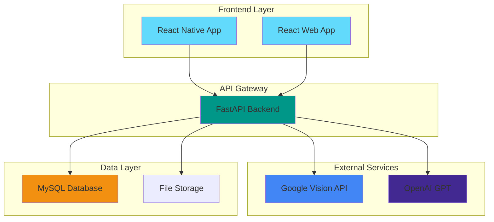
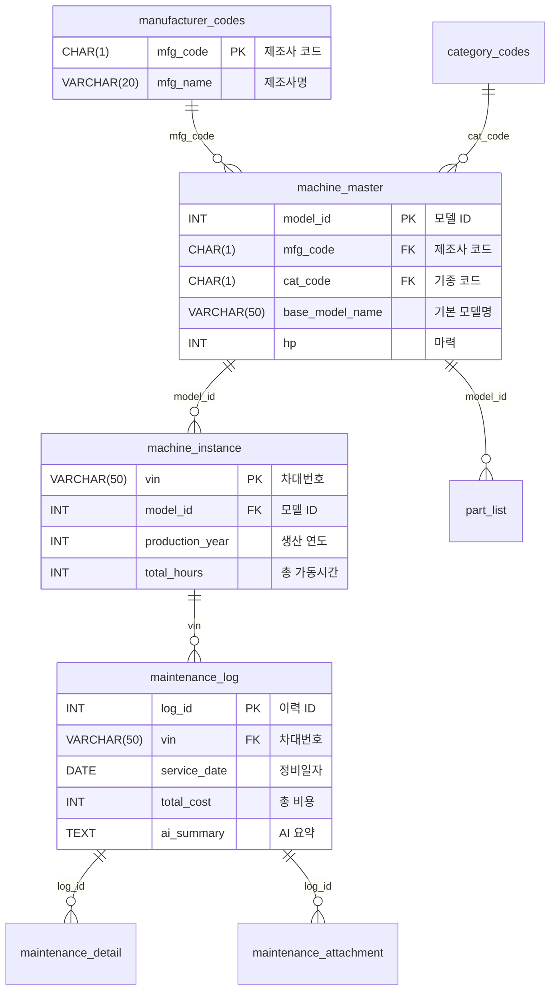

# 농기계 데이터 이력관리 플랫폼 (Agri Log)

<div align="center">

[](LICENSE)
[](https://python.org)
[](https://reactjs.org)
[](https://reactnative.dev)
[](https://docker.com)

**농기계 소유자와 정비업체를 위한 종합적인 정비 이력 관리 솔루션**

[시작하기](#시작하기) • [기능](#주요-기능) • [아키텍처](#아키텍처) • [API](#api) • [문서](#문서)

</div>

---

## 개요

**Agri Log**는 농기계의 정비 이력을 효율적으로 관리하기 위한 통합 플랫폼입니다. OCR 기술, AI 예측, 모바일 앱을 결합하여 농기계 소유자와 정비업체 모두에게 최적의 경험을 제공합니다.

### 핵심 가치
- **자동화**: OCR 스캔으로 정비 명세서 자동 입력
- **지능화**: AI 기반 가격 예측 및 전문가 상담
- **편의성**: 모바일 앱으로 언제든지 이력 조회
- **투명성**: 완벽한 정비 이력 추적 및 관리

---

## 주요 기능

### 모바일 앱 (React Native)
- **역할 기반 화면**: 농민용/정비업체용 전용 인터페이스
- **OCR 스캔**: 정비 명세서 사진 촬영으로 자동 데이터 입력
- **QR 코드**: 농기계 정보 QR 생성 및 스캔
- **AI 가격 예측**: 사용시간 기반 자산 가치 평가
- **AI 챗봇**: 정비 전문가 상담 서비스

### 웹 앱 (React)
- **대시보드**: 종합적인 농기계 현황 및 통계
- **이력 관리**: 상세한 정비 이력 조회 및 수정
- **부품 관리**: 모델별 부품 정보 관리
- **데이터 분석**: 비용 추이 및 사용 패턴 분석

### 백엔드 (FastAPI)
- **REST API**: 완전한 RESTful API 제공
- **OCR 처리**: Google Cloud Vision API 연동
- **AI 예측**: 머신러닝 기반 가격 예측
- **데이터베이스**: MySQL 기반 정규화된 데이터 구조

---

## 아키텍처

### 전체 시스템 구조



### 기술 스택

| 구분 | 기술 | 버전 | 설명 |
|------|------|------|------|
| **Frontend** | React | 19.2+ | 웹 앱 프레임워크 |
| | React Native | 0.81+ | 모바일 앱 프레임워크 |
| | Expo | ~54.0 | 모바일 개발 플랫폼 |
| | TailwindCSS | 3.4+ | CSS 프레임워크 |
| **Backend** | FastAPI | 0.135+ | Python 웹 프레임워크 |
| | SQLAlchemy | 2.0+ | ORM |
| | Pydantic | 2.12+ | 데이터 검증 |
| | PyMySQL | 1.1+ | MySQL 드라이버 |
| **AI/ML** | scikit-learn | 1.5+ | 머신러닝 라이브러리 |
| | OpenAI | 1.58+ | AI 챗봇 API |
| | Google Vision | 3.8+ | OCR API |
| **Database** | MySQL | 8.0+ | 관계형 데이터베이스 |
| **DevOps** | Docker | latest | 컨테이너화 |
| | Docker Compose | 3.8+ | 다중 컨테이너 관리 |

---

## 시작하기

### 요구사항

- **Docker**: 20.10+ 및 Docker Compose
- **Node.js**: 18+ (로컬 개발 시)
- **Python**: 3.9+ (로컬 개발 시)
- **API 키**: Google Vision API, OpenAI API

### 빠른 시작 (Docker)

1. **저장소 클론**
```bash
git clone https://github.com/your-username/agrilog.git
cd agrilog
```

2. **환경변수 설정**
```bash
cp .env.example .env
# .env 파일에 API 키 및 설정 입력
```

3. **Docker 컨테이너 시작**
```bash
# Windows
docker-start.bat

# Linux/Mac
docker-compose up -d
```

4. **서비스 접속**
- **웹 앱**: http://localhost:80
- **API 문서**: http://localhost:8000/docs
- **데이터베이스**: localhost:3307

### 모바일 앱 실행

1. **의존성 설치**
```bash
cd agri-mobile
npm install
```

2. **환경변수 설정**
```bash
cp .env.example .env
# .env 파일에 API URL 및 설정 입력
```

3. **Expo 개발 서버 시작**
```bash
npm start
# Expo Go 앱으로 QR 코드 스캔
```

---

## 데이터베이스

### 핵심 테이블 구조



### VIN 파싱 시스템

농기계 차대번호(VIN)를 표준화된 형식으로 파싱합니다:

```
예시: DI008024656
├── D: 대동 (제조사)
├── I: 콤바인 (기종)
├── 0080: 모델 식별자
├── 24: 생산 연도 (2024년)
└── 656: 일련번호
```

---

## API 명세

### 기본 정보
- **Base URL**: `http://localhost:8000/api/v1`
- **데이터 형식**: JSON
- **인증**: 현재 없음 (향후 JWT 추가 예정)

### 주요 엔드포인트

#### 농기계 관리
```http
GET    /machines                    # 농기계 목록 조회
GET    /machines/{vin}              # 특정 농기계 상세 정보
POST   /machines                    # 농기계 등록
PUT    /machines/{vin}              # 농기계 정보 수정
DELETE /machines/{vin}              # 농기계 삭제
```

#### 정비 이력
```http
GET    /history/machine/{vin}        # 특정 농기계 정비 이력
POST   /history/                    # 정비 이력 추가
PUT    /history/{record_id}         # 정비 이력 수정
DELETE /history/{record_id}         # 정비 이력 삭제
GET    /history/unverified          # 검증 실패 이력 조회
```

#### OCR 처리
```http
POST   /ocr/google-vision-ocr       # Google Vision OCR 처리
POST   /ocr/process-and-save         # OCR 처리 및 데이터 저장
GET    /ocr/status/{attachment_id}  # OCR 처리 상태 조회
```

#### AI 기능
```http
POST   /price/predict               # AI 가격 예측
POST   /ai/expert-advice           # AI 전문가 상담
POST   /ai/mechanic-chat           # 정비업체 AI 챗봇
```

### 응답 형식

#### 성공 응답
```json
{
  "success": true,
  "message": "정비 이력이 추가되었습니다.",
  "data": {
    "id": 123,
    "vin": "DC0001240001"
  }
}
```

#### 에러 응답
```json
{
  "detail": "등록되지 않은 농기계입니다."
}
```

---

## 개발

### 프로젝트 구조

```
agrilog/
├── backend/                 # FastAPI 백엔드
│   ├── app/                # 애플리케이션 코드
│   ├── ML/                 # 머신러닝 모델
│   ├── requirements.txt    # Python 의존성
│   └── Dockerfile         # Docker 설정
├── frontend/               # React 웹 앱
│   ├── src/               # 소스 코드
│   ├── package.json       # Node.js 의존성
│   └── Dockerfile         # Docker 설정
├── agri-mobile/            # React Native 모바일 앱
│   ├── src/               # 소스 코드
│   └── package.json       # Node.js 의존성
├── docs/                   # 프로젝트 문서
├── docker-compose.yml      # Docker Compose 설정
└── README.md              # 이 파일
```

### 로컬 개발 환경

#### 백엔드 개발
```bash
cd backend
python -m venv venv
source venv/bin/activate  # Windows: venv\Scripts\activate
pip install -r requirements.txt
uvicorn app.main:app --reload --host 0.0.0.0 --port 8000
```

#### 프론트엔드 개발
```bash
cd frontend
npm install
npm run dev
```

#### 모바일 앱 개발
```bash
cd agri-mobile
npm install
npm start
```

---

## 테스트

### 백엔드 테스트
```bash
cd backend
pytest tests/
```

### 프론트엔드 테스트
```bash
cd frontend
npm test
```

### API 테스트
API 문서에서 직접 테스트: http://localhost:8000/docs

---

## 배포

### Docker 배포
```bash
# 빌드 및 시작
docker-compose up -d --build

# 로그 확인
docker-compose logs -f

# 중지
docker-compose down
```

### 환경변수

필수 환경변수 목록 (.env 파일에 설정):

```bash
# 데이터베이스
MYSQL_ROOT_PASSWORD=your_secure_password
MYSQL_DATABASE=agrilog_db
MYSQL_USER=agri_user
MYSQL_PASSWORD=your_secure_password

# API 키 (실제 키로 교체 필요)
OPENAI_API_KEY=your_actual_openai_api_key
GOOGLE_APPLICATION_CREDENTIALS=/app/credentials/google-credentials.json

# 프론트엔드
VITE_API_URL=http://localhost:8000
```

**보안 주의사항:**
- `.env` 파일은 절대 Git에 커밋하지 마세요
- API 키는 보안 저장소나 환경변수로 관리하세요
- 비밀번호는 강력한 조합으로 설정하세요

---

## 인증

**보안 상태**: 현재 인증 시스템이 구현되어 있지 않습니다. 향후 JWT 기반 인증이 추가될 예정입니다.

---

## 기여

기여를 환영합니다! 아래 절차를 따라주세요:

1. 저장소를 포크합니다
2. 기능 브랜치를 생성합니다 (`git checkout -b feature/AmazingFeature`)
3. 변경사항을 커밋합니다 (`git commit -m 'Add some AmazingFeature'`)
4. 브랜치에 푸시합니다 (`git push origin feature/AmazingFeature`)
5. Pull Request를 생성합니다

### 코드 스타일

- **Python**: PEP 8 준수
- **JavaScript/React**: ESLint 규칙 준수
- **커밋 메시지**: [Conventional Commits](https://conventionalcommits.org/) 형식

---

## 라이선스

이 프로젝트는 MIT 라이선스 하에 배포됩니다. [LICENSE](LICENSE) 파일을 확인하세요.

---

## 문의


- **GitHub Issues**: [이슈 페이지](https://github.com/your-username/agrilog/issues)
- **문서**: [프로젝트 문서](./docs/)

---

## 감사

- [Google Cloud Vision API](https://cloud.google.com/vision) - OCR 기술 제공
- [OpenAI](https://openai.com) - AI 기술 제공
- [FastAPI](https://fastapi.tiangolo.com) - 웹 프레임워크
- [React Native](https://reactnative.dev) - 모바일 프레임워크

---

<div align="center">

**이 프로젝트가 마음에 드셨다면 Star를 눌러주세요!**

Made with love for Farmers & Mechanics

</div>
